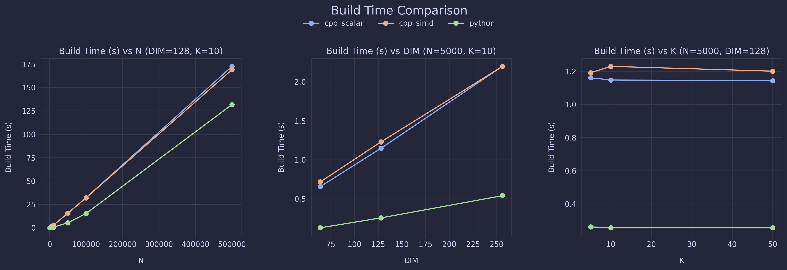
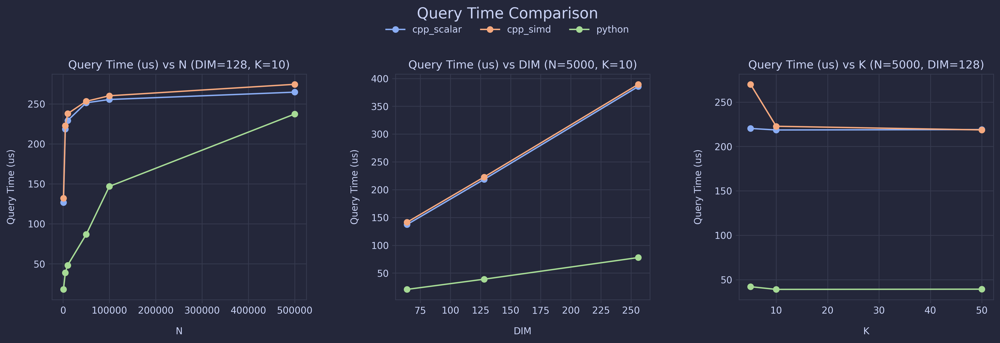

## Benchmark Report

Run: `16-03-2026-22-32`

## System Information

| Property | Value |
| --- | --- |
| Operating System | Darwin 15.7.4 |
| Architecture | arm64 |
| CPU | arm |
| CPU Cores | 8 |
| Memory | 24.0 GB |
| Python Version | 3.13.12 |

## C++ Benchmark Results

| impl | N | DIM | K | build_s | query_us | brute_us | speedup | recall |
| --- | --- | --- | --- | --- | --- | --- | --- | --- |
| cpp_scalar | 1000 | 64 | 5 | 0.1010 | 76.7300 | 17.2600 | 0.2249 | 1.0000 |
| cpp_scalar | 1000 | 64 | 10 | 0.0709 | 80.3500 | 18.3700 | 0.2286 | 1.0000 |
| cpp_scalar | 1000 | 64 | 50 | 0.0723 | 78.7800 | 24.0400 | 0.3052 | 1.0000 |
| cpp_scalar | 1000 | 128 | 5 | 0.1221 | 129.5900 | 50.3300 | 0.3884 | 1.0000 |
| cpp_scalar | 1000 | 128 | 10 | 0.1215 | 126.8100 | 50.5900 | 0.3989 | 1.0000 |
| cpp_scalar | 1000 | 128 | 50 | 0.1218 | 124.1300 | 55.6200 | 0.4481 | 1.0000 |
| cpp_scalar | 1000 | 256 | 5 | 0.2253 | 232.4100 | 102.7500 | 0.4421 | 1.0000 |
| cpp_scalar | 1000 | 256 | 10 | 0.2241 | 234.4800 | 110.5300 | 0.4714 | 1.0000 |
| cpp_scalar | 1000 | 256 | 50 | 0.2286 | 223.1100 | 109.6300 | 0.4914 | 1.0000 |
| cpp_scalar | 5000 | 64 | 5 | 0.6520 | 137.0500 | 90.8200 | 0.6627 | 1.0000 |
| cpp_scalar | 5000 | 64 | 10 | 0.6559 | 137.2700 | 90.3000 | 0.6578 | 1.0000 |
| cpp_scalar | 5000 | 64 | 50 | 0.6663 | 140.1900 | 100.9800 | 0.7203 | 1.0000 |
| cpp_scalar | 5000 | 128 | 5 | 1.1607 | 220.2800 | 249.9300 | 1.1346 | 1.0000 |
| cpp_scalar | 5000 | 128 | 10 | 1.1477 | 218.5500 | 250.5900 | 1.1466 | 1.0000 |
| cpp_scalar | 5000 | 128 | 50 | 1.1425 | 219.0100 | 255.3800 | 1.1661 | 1.0000 |
| cpp_scalar | 5000 | 256 | 5 | 2.1266 | 379.7500 | 542.8200 | 1.4294 | 1.0000 |
| cpp_scalar | 5000 | 256 | 10 | 2.1981 | 385.5900 | 546.0000 | 1.4160 | 1.0000 |
| cpp_scalar | 5000 | 256 | 50 | 2.1125 | 385.4300 | 541.7200 | 1.4055 | 1.0000 |
| cpp_scalar | 10000 | 64 | 5 | 1.5510 | 149.2600 | 180.8600 | 1.2117 | 1.0000 |
| cpp_scalar | 10000 | 64 | 10 | 1.5477 | 154.4000 | 184.9300 | 1.1977 | 1.0000 |
| cpp_scalar | 10000 | 64 | 50 | 1.5726 | 152.3500 | 190.4200 | 1.2499 | 1.0000 |
| cpp_scalar | 10000 | 128 | 5 | 2.6349 | 230.9200 | 499.1600 | 2.1616 | 1.0000 |
| cpp_scalar | 10000 | 128 | 10 | 2.6279 | 229.1400 | 485.8900 | 2.1205 | 1.0000 |
| cpp_scalar | 10000 | 128 | 50 | 2.6574 | 235.3200 | 506.2000 | 2.1511 | 1.0000 |
| cpp_scalar | 10000 | 256 | 5 | 4.8633 | 404.4000 | 1094.5600 | 2.7066 | 1.0000 |
| cpp_scalar | 10000 | 256 | 10 | 4.8302 | 395.5900 | 1083.5600 | 2.7391 | 1.0000 |
| cpp_scalar | 10000 | 256 | 50 | 4.8082 | 404.3300 | 1098.1300 | 2.7159 | 1.0000 |
| cpp_scalar | 50000 | 64 | 5 | 9.4544 | 166.8900 | 901.5700 | 5.4022 | 1.0000 |
| cpp_scalar | 50000 | 64 | 10 | 9.5233 | 167.8300 | 897.8800 | 5.3499 | 1.0000 |
| cpp_scalar | 50000 | 64 | 50 | 9.4640 | 166.1500 | 910.3700 | 5.4792 | 1.0000 |
| cpp_scalar | 50000 | 128 | 5 | 15.5079 | 256.9900 | 2436.3000 | 9.4801 | 1.0000 |
| cpp_scalar | 50000 | 128 | 10 | 15.5916 | 251.3300 | 2447.6200 | 9.7387 | 1.0000 |
| cpp_scalar | 50000 | 128 | 50 | 15.6248 | 259.4000 | 2480.6500 | 9.5630 | 1.0000 |
| cpp_scalar | 50000 | 256 | 5 | 27.1023 | 417.3300 | 5451.5600 | 13.0629 | 1.0000 |
| cpp_scalar | 50000 | 256 | 10 | 27.9395 | 445.0100 | 5483.2400 | 12.3216 | 1.0000 |
| cpp_scalar | 50000 | 256 | 50 | 27.3398 | 416.5000 | 5497.2800 | 13.1988 | 1.0000 |
| cpp_scalar | 100000 | 64 | 5 | 19.7915 | 172.1300 | 1792.4800 | 10.4135 | 1.0000 |
| cpp_scalar | 100000 | 64 | 10 | 19.9396 | 176.7600 | 1781.2200 | 10.0771 | 1.0000 |
| cpp_scalar | 100000 | 64 | 50 | 19.9039 | 174.1700 | 1821.0800 | 10.4558 | 1.0000 |
| cpp_scalar | 100000 | 128 | 5 | 32.7768 | 261.0600 | 4903.4700 | 18.7829 | 1.0000 |
| cpp_scalar | 100000 | 128 | 10 | 32.1252 | 255.4800 | 4926.0000 | 19.2814 | 1.0000 |
| cpp_scalar | 100000 | 128 | 50 | 32.0525 | 257.5300 | 4955.0600 | 19.2407 | 1.0000 |
| cpp_scalar | 100000 | 256 | 5 | 56.7765 | 434.4500 | 11241.5000 | 25.8752 | 1.0000 |
| cpp_scalar | 100000 | 256 | 10 | 56.9850 | 437.9700 | 11097.4000 | 25.3383 | 1.0000 |
| cpp_scalar | 100000 | 256 | 50 | 56.7466 | 431.1100 | 11039.1000 | 25.6062 | 1.0000 |
| cpp_scalar | 500000 | 64 | 5 | 110.1940 | 192.9300 | 8982.3400 | 46.5575 | 1.0000 |
| cpp_scalar | 500000 | 64 | 10 | 109.1920 | 184.5200 | 8985.0400 | 48.6941 | 1.0000 |
| cpp_scalar | 500000 | 64 | 50 | 109.6020 | 185.2300 | 9084.1000 | 49.0423 | 1.0000 |
| cpp_scalar | 500000 | 128 | 5 | 171.0300 | 268.6300 | 24628.0000 | 91.6798 | 1.0000 |
| cpp_scalar | 500000 | 128 | 10 | 172.5330 | 264.6700 | 24884.0000 | 94.0189 | 1.0000 |
| cpp_scalar | 500000 | 128 | 50 | 173.3350 | 271.3400 | 25136.5000 | 92.6384 | 1.0000 |
| cpp_scalar | 500000 | 256 | 5 | 301.8840 | 458.9900 | 56087.1000 | 122.1970 | 1.0000 |
| cpp_scalar | 500000 | 256 | 10 | 297.9330 | 433.5500 | 55738.4000 | 128.5630 | 1.0000 |
| cpp_scalar | 500000 | 256 | 50 | 299.7460 | 440.6400 | 56603.9000 | 128.4580 | 1.0000 |
| cpp_simd | 1000 | 64 | 5 | 0.0741 | 81.1800 | 18.8200 | 0.2318 | 1.0000 |
| cpp_simd | 1000 | 64 | 10 | 0.0747 | 80.3100 | 19.2400 | 0.2396 | 1.0000 |
| cpp_simd | 1000 | 64 | 50 | 0.0740 | 80.9500 | 23.3800 | 0.2888 | 1.0000 |
| cpp_simd | 1000 | 128 | 5 | 0.1251 | 130.4600 | 50.3200 | 0.3857 | 1.0000 |
| cpp_simd | 1000 | 128 | 10 | 0.1248 | 131.9300 | 50.9000 | 0.3858 | 1.0000 |
| cpp_simd | 1000 | 128 | 50 | 0.1247 | 131.7800 | 55.4100 | 0.4205 | 1.0000 |
| cpp_simd | 1000 | 256 | 5 | 0.2305 | 234.2600 | 110.6200 | 0.4722 | 1.0000 |
| cpp_simd | 1000 | 256 | 10 | 0.2295 | 231.6500 | 110.9800 | 0.4791 | 1.0000 |
| cpp_simd | 1000 | 256 | 50 | 0.2321 | 234.5800 | 115.6400 | 0.4930 | 1.0000 |
| cpp_simd | 5000 | 64 | 5 | 0.7070 | 142.6500 | 100.3900 | 0.7037 | 1.0000 |
| cpp_simd | 5000 | 64 | 10 | 0.7165 | 141.3900 | 93.9600 | 0.6645 | 1.0000 |
| cpp_simd | 5000 | 64 | 50 | 0.7033 | 142.6500 | 298.6800 | 2.0938 | 1.0000 |
| cpp_simd | 5000 | 128 | 5 | 1.1914 | 270.0000 | 307.7500 | 1.1398 | 1.0000 |
| cpp_simd | 5000 | 128 | 10 | 1.2298 | 222.7200 | 248.7800 | 1.1170 | 1.0000 |
| cpp_simd | 5000 | 128 | 50 | 1.2006 | 218.6300 | 256.4300 | 1.1729 | 1.0000 |
| cpp_simd | 5000 | 256 | 5 | 2.1772 | 384.7600 | 554.2800 | 1.4406 | 1.0000 |
| cpp_simd | 5000 | 256 | 10 | 2.1970 | 389.5200 | 619.4000 | 1.5902 | 1.0000 |
| cpp_simd | 5000 | 256 | 50 | 2.2398 | 387.0600 | 574.1600 | 1.4834 | 1.0000 |
| cpp_simd | 10000 | 64 | 5 | 1.6375 | 152.8700 | 183.5700 | 1.2008 | 1.0000 |
| cpp_simd | 10000 | 64 | 10 | 1.5776 | 151.5200 | 181.1900 | 1.1958 | 1.0000 |
| cpp_simd | 10000 | 64 | 50 | 1.5825 | 149.6100 | 195.8400 | 1.3090 | 1.0000 |
| cpp_simd | 10000 | 128 | 5 | 2.7418 | 242.4500 | 543.0800 | 2.2400 | 1.0000 |
| cpp_simd | 10000 | 128 | 10 | 2.6698 | 237.7300 | 497.9600 | 2.0947 | 1.0000 |
| cpp_simd | 10000 | 128 | 50 | 2.6687 | 233.4000 | 507.3000 | 2.1735 | 1.0000 |
| cpp_simd | 10000 | 256 | 5 | 4.8825 | 406.6200 | 1125.4700 | 2.7679 | 1.0000 |
| cpp_simd | 10000 | 256 | 10 | 4.8463 | 405.5000 | 1108.6000 | 2.7339 | 1.0000 |
| cpp_simd | 10000 | 256 | 50 | 4.8168 | 388.2400 | 1116.6000 | 2.8761 | 1.0000 |
| cpp_simd | 50000 | 64 | 5 | 9.4438 | 166.9200 | 904.9200 | 5.4213 | 1.0000 |
| cpp_simd | 50000 | 64 | 10 | 9.4837 | 167.8000 | 903.4800 | 5.3843 | 1.0000 |
| cpp_simd | 50000 | 64 | 50 | 9.5517 | 168.1600 | 912.4000 | 5.4258 | 1.0000 |
| cpp_simd | 50000 | 128 | 5 | 15.5552 | 258.0000 | 2442.3600 | 9.4665 | 1.0000 |
| cpp_simd | 50000 | 128 | 10 | 15.6711 | 253.2500 | 2471.7900 | 9.7603 | 1.0000 |
| cpp_simd | 50000 | 128 | 50 | 15.7718 | 266.4000 | 2489.4900 | 9.3449 | 1.0000 |
| cpp_simd | 50000 | 256 | 5 | 27.8635 | 416.8900 | 5516.4100 | 13.2323 | 1.0000 |
| cpp_simd | 50000 | 256 | 10 | 28.1082 | 428.7800 | 5553.7200 | 12.9524 | 1.0000 |
| cpp_simd | 50000 | 256 | 50 | 27.7827 | 424.2900 | 5558.2900 | 13.1002 | 1.0000 |
| cpp_simd | 100000 | 64 | 5 | 20.2219 | 179.8700 | 1949.1700 | 10.8365 | 1.0000 |
| cpp_simd | 100000 | 64 | 10 | 20.1262 | 172.7400 | 1770.4700 | 10.2493 | 1.0000 |
| cpp_simd | 100000 | 64 | 50 | 19.8771 | 170.7500 | 1818.6200 | 10.6508 | 1.0000 |
| cpp_simd | 100000 | 128 | 5 | 32.3612 | 258.3000 | 4949.1500 | 19.1605 | 1.0000 |
| cpp_simd | 100000 | 128 | 10 | 32.0262 | 260.1400 | 4959.3200 | 19.0640 | 1.0000 |
| cpp_simd | 100000 | 128 | 50 | 31.7969 | 256.4100 | 4957.1400 | 19.3329 | 1.0000 |
| cpp_simd | 100000 | 256 | 5 | 56.5981 | 431.4400 | 10979.7000 | 25.4490 | 1.0000 |
| cpp_simd | 100000 | 256 | 10 | 55.7265 | 421.4300 | 10982.9000 | 26.0610 | 1.0000 |
| cpp_simd | 100000 | 256 | 50 | 55.6773 | 422.3400 | 10990.2000 | 26.0223 | 1.0000 |
| cpp_simd | 500000 | 64 | 5 | 109.1550 | 186.1600 | 9084.6400 | 48.8002 | 1.0000 |
| cpp_simd | 500000 | 64 | 10 | 109.3880 | 186.9100 | 9302.1800 | 49.7682 | 1.0000 |
| cpp_simd | 500000 | 64 | 50 | 107.4700 | 183.9600 | 9097.6500 | 49.4545 | 1.0000 |
| cpp_simd | 500000 | 128 | 5 | 167.6320 | 265.3300 | 24890.3000 | 93.8088 | 1.0000 |
| cpp_simd | 500000 | 128 | 10 | 168.9640 | 274.4800 | 24865.2000 | 90.5901 | 1.0000 |
| cpp_simd | 500000 | 128 | 50 | 167.1950 | 261.9400 | 24889.8000 | 95.0211 | 1.0000 |
| cpp_simd | 500000 | 256 | 5 | 288.9820 | 431.8400 | 54920.3000 | 127.1770 | 1.0000 |
| cpp_simd | 500000 | 256 | 10 | 291.1450 | 442.1400 | 54917.7000 | 124.2090 | 1.0000 |
| cpp_simd | 500000 | 256 | 50 | 289.7950 | 442.2000 | 54931.9000 | 124.2240 | 1.0000 |

## Python (hnswlib) Benchmark Results

| impl | N | DIM | K | build_s | query_us | brute_us | speedup | recall |
| --- | --- | --- | --- | --- | --- | --- | --- | --- |
| python | 1000 | 64 | 5 | 0.0162 | 11.5609 | 69.0103 | 5.9693 | 1.0000 |
| python | 1000 | 64 | 10 | 0.0162 | 11.7397 | 65.9728 | 5.6196 | 1.0000 |
| python | 1000 | 64 | 50 | 0.0161 | 11.7278 | 70.5600 | 6.0165 | 1.0000 |
| python | 1000 | 128 | 5 | 0.0242 | 18.2223 | 103.6596 | 5.6886 | 1.0000 |
| python | 1000 | 128 | 10 | 0.0241 | 18.0888 | 86.3600 | 4.7742 | 1.0000 |
| python | 1000 | 128 | 50 | 0.0242 | 18.1818 | 87.4519 | 4.8099 | 1.0000 |
| python | 1000 | 256 | 5 | 0.0443 | 47.1187 | 124.1922 | 2.6357 | 1.0000 |
| python | 1000 | 256 | 10 | 0.0417 | 31.7526 | 120.9593 | 3.8094 | 1.0000 |
| python | 1000 | 256 | 50 | 0.0415 | 31.8313 | 120.7709 | 3.7941 | 1.0000 |
| python | 5000 | 64 | 5 | 0.1274 | 20.8783 | 357.3132 | 17.1141 | 1.0000 |
| python | 5000 | 64 | 10 | 0.1281 | 20.6685 | 375.5283 | 18.1691 | 1.0000 |
| python | 5000 | 64 | 50 | 0.1320 | 20.9713 | 367.7583 | 17.5363 | 1.0000 |
| python | 5000 | 128 | 5 | 0.2610 | 42.0308 | 536.9925 | 12.7762 | 1.0000 |
| python | 5000 | 128 | 10 | 0.2553 | 39.0005 | 543.6993 | 13.9408 | 1.0000 |
| python | 5000 | 128 | 50 | 0.2554 | 39.2413 | 541.8277 | 13.8076 | 1.0000 |
| python | 5000 | 256 | 5 | 0.5408 | 78.8379 | 801.0912 | 10.1612 | 1.0000 |
| python | 5000 | 256 | 10 | 0.5398 | 77.9390 | 785.0695 | 10.0729 | 1.0000 |
| python | 5000 | 256 | 50 | 0.5392 | 78.3014 | 777.5617 | 9.9304 | 1.0000 |
| python | 10000 | 64 | 5 | 0.3068 | 24.8790 | 819.9286 | 32.9567 | 1.0000 |
| python | 10000 | 64 | 10 | 0.3064 | 24.3807 | 818.9321 | 33.5894 | 1.0000 |
| python | 10000 | 64 | 50 | 0.3070 | 25.1889 | 856.2183 | 33.9919 | 1.0000 |
| python | 10000 | 128 | 5 | 0.6623 | 48.8806 | 1100.0776 | 22.5054 | 1.0000 |
| python | 10000 | 128 | 10 | 0.6652 | 48.2464 | 1121.0585 | 23.2361 | 1.0000 |
| python | 10000 | 128 | 50 | 0.6635 | 48.1200 | 1109.3998 | 23.0548 | 1.0000 |
| python | 10000 | 256 | 5 | 1.4307 | 97.6014 | 1329.8106 | 13.6249 | 1.0000 |
| python | 10000 | 256 | 10 | 1.4316 | 95.5701 | 1580.6985 | 16.5397 | 1.0000 |
| python | 10000 | 256 | 50 | 1.4344 | 96.5500 | 1577.1389 | 16.3349 | 1.0000 |
| python | 50000 | 64 | 5 | 2.2890 | 40.6194 | 4598.4793 | 113.2090 | 1.0000 |
| python | 50000 | 64 | 10 | 2.3262 | 39.9685 | 4592.0181 | 114.8910 | 1.0000 |
| python | 50000 | 64 | 50 | 2.3388 | 40.4406 | 4250.2618 | 105.0990 | 1.0000 |
| python | 50000 | 128 | 5 | 5.3410 | 86.8583 | 6404.3212 | 73.7330 | 0.9600 |
| python | 50000 | 128 | 10 | 5.3677 | 86.7486 | 6408.1311 | 73.8701 | 0.9600 |
| python | 50000 | 128 | 50 | 5.4024 | 87.5902 | 6590.5690 | 75.2432 | 0.9600 |
| python | 50000 | 256 | 5 | 11.9251 | 191.5479 | 10079.9680 | 52.6238 | 0.8700 |
| python | 50000 | 256 | 10 | 12.0939 | 202.1694 | 10340.5976 | 51.1482 | 0.8800 |
| python | 50000 | 256 | 50 | 12.5516 | 231.8597 | 9696.6505 | 41.8212 | 0.8700 |
| python | 100000 | 64 | 5 | 6.5273 | 72.1002 | 10015.2707 | 138.9077 | 1.0000 |
| python | 100000 | 64 | 10 | 6.6053 | 72.6700 | 9836.2303 | 135.3548 | 1.0000 |
| python | 100000 | 64 | 50 | 6.6037 | 68.4381 | 9967.8898 | 145.6484 | 1.0000 |
| python | 100000 | 128 | 5 | 14.8255 | 143.7426 | 13387.7516 | 93.1370 | 0.9300 |
| python | 100000 | 128 | 10 | 15.2923 | 146.8706 | 13617.1985 | 92.7156 | 0.9200 |
| python | 100000 | 128 | 50 | 16.5275 | 153.9993 | 14059.5579 | 91.2962 | 0.9100 |
| python | 100000 | 256 | 5 | 38.4803 | 323.0810 | 22531.5475 | 69.7396 | 0.7600 |
| python | 100000 | 256 | 10 | 38.1652 | 310.3280 | 21142.7212 | 68.1302 | 0.7700 |
| python | 100000 | 256 | 50 | 36.9512 | 307.6696 | 20617.4088 | 67.0115 | 0.7400 |
| python | 500000 | 64 | 5 | 64.6856 | 128.0308 | 55551.2238 | 433.8896 | 0.9000 |
| python | 500000 | 64 | 10 | 65.0699 | 128.0904 | 55131.0372 | 430.4073 | 0.9300 |
| python | 500000 | 64 | 50 | 65.3537 | 130.7702 | 55307.6625 | 422.9378 | 0.9300 |
| python | 500000 | 128 | 5 | 130.8075 | 234.8018 | 81090.3621 | 345.3567 | 0.6900 |
| python | 500000 | 128 | 10 | 131.7432 | 237.3576 | 80773.8018 | 340.3042 | 0.6500 |
| python | 500000 | 128 | 50 | 142.5310 | 252.1229 | 81125.4191 | 321.7694 | 0.6600 |
| python | 500000 | 256 | 5 | 252.9590 | 445.6687 | 119533.2003 | 268.2109 | 0.4000 |
| python | 500000 | 256 | 10 | 248.3713 | 431.1180 | 119055.1925 | 276.1545 | 0.3900 |
| python | 500000 | 256 | 50 | 239.4652 | 439.0025 | 118388.2689 | 269.6756 | 0.4100 |

## Comparison (C++ SIMD vs Python)

| N | DIM | K | build_s_cpp_scalar | build_s_cpp_simd | build_s_python | query_us_cpp_scalar | query_us_cpp_simd | query_us_python | build_delta_% | query_delta_% |
| --- | --- | --- | --- | --- | --- | --- | --- | --- | --- | --- |
| 1000.0000 | 64.0000 | 5.0000 | 0.1010 | 0.0741 | 0.0162 | 76.7300 | 81.1800 | 11.5609 | 357.5520 | 602.1934 |
| 1000.0000 | 64.0000 | 10.0000 | 0.0709 | 0.0747 | 0.0162 | 80.3500 | 80.3100 | 11.7397 | 362.5171 | 584.0872 |
| 1000.0000 | 64.0000 | 50.0000 | 0.0723 | 0.0740 | 0.0161 | 78.7800 | 80.9500 | 11.7278 | 358.6699 | 590.2397 |
| 1000.0000 | 128.0000 | 5.0000 | 0.1221 | 0.1251 | 0.0242 | 129.5900 | 130.4600 | 18.2223 | 416.4792 | 615.9347 |
| 1000.0000 | 128.0000 | 10.0000 | 0.1215 | 0.1248 | 0.0241 | 126.8100 | 131.9300 | 18.0888 | 418.4051 | 629.3456 |
| 1000.0000 | 128.0000 | 50.0000 | 0.1218 | 0.1247 | 0.0242 | 124.1300 | 131.7800 | 18.1818 | 414.9455 | 624.7907 |
| 1000.0000 | 256.0000 | 5.0000 | 0.2253 | 0.2305 | 0.0443 | 232.4100 | 234.2600 | 47.1187 | 420.0603 | 397.1703 |
| 1000.0000 | 256.0000 | 10.0000 | 0.2241 | 0.2295 | 0.0417 | 234.4800 | 231.6500 | 31.7526 | 450.8858 | 629.5469 |
| 1000.0000 | 256.0000 | 50.0000 | 0.2286 | 0.2321 | 0.0415 | 223.1100 | 234.5800 | 31.8313 | 458.6124 | 636.9484 |
| 5000.0000 | 64.0000 | 5.0000 | 0.6520 | 0.7070 | 0.1274 | 137.0500 | 142.6500 | 20.8783 | 455.1274 | 583.2448 |
| 5000.0000 | 64.0000 | 10.0000 | 0.6559 | 0.7165 | 0.1281 | 137.2700 | 141.3900 | 20.6685 | 459.1919 | 584.0843 |
| 5000.0000 | 64.0000 | 50.0000 | 0.6663 | 0.7033 | 0.1320 | 140.1900 | 142.6500 | 20.9713 | 433.0086 | 580.2154 |
| 5000.0000 | 128.0000 | 5.0000 | 1.1607 | 1.1914 | 0.2610 | 220.2800 | 270.0000 | 42.0308 | 356.5120 | 542.3859 |
| 5000.0000 | 128.0000 | 10.0000 | 1.1477 | 1.2298 | 0.2553 | 218.5500 | 222.7200 | 39.0005 | 381.6945 | 471.0694 |
| 5000.0000 | 128.0000 | 50.0000 | 1.1425 | 1.2006 | 0.2554 | 219.0100 | 218.6300 | 39.2413 | 370.1791 | 457.1424 |
| 5000.0000 | 256.0000 | 5.0000 | 2.1266 | 2.1772 | 0.5408 | 379.7500 | 384.7600 | 78.8379 | 302.6213 | 388.0396 |
| 5000.0000 | 256.0000 | 10.0000 | 2.1981 | 2.1970 | 0.5398 | 385.5900 | 389.5200 | 77.9390 | 306.9705 | 399.7753 |
| 5000.0000 | 256.0000 | 50.0000 | 2.1125 | 2.2398 | 0.5392 | 385.4300 | 387.0600 | 78.3014 | 315.3793 | 394.3205 |
| 10000.0000 | 64.0000 | 5.0000 | 1.5510 | 1.6375 | 0.3068 | 149.2600 | 152.8700 | 24.8790 | 433.7078 | 514.4545 |
| 10000.0000 | 64.0000 | 10.0000 | 1.5477 | 1.5776 | 0.3064 | 154.4000 | 151.5200 | 24.3807 | 414.8084 | 521.4756 |
| 10000.0000 | 64.0000 | 50.0000 | 1.5726 | 1.5825 | 0.3070 | 152.3500 | 149.6100 | 25.1889 | 415.4678 | 493.9516 |
| 10000.0000 | 128.0000 | 5.0000 | 2.6349 | 2.7418 | 0.6623 | 230.9200 | 242.4500 | 48.8806 | 313.9606 | 396.0048 |
| 10000.0000 | 128.0000 | 10.0000 | 2.6279 | 2.6698 | 0.6652 | 229.1400 | 237.7300 | 48.2464 | 301.3237 | 392.7416 |
| 10000.0000 | 128.0000 | 50.0000 | 2.6574 | 2.6687 | 0.6635 | 235.3200 | 233.4000 | 48.1200 | 302.2099 | 385.0372 |
| 10000.0000 | 256.0000 | 5.0000 | 4.8633 | 4.8825 | 1.4307 | 404.4000 | 406.6200 | 97.6014 | 241.2692 | 316.6128 |
| 10000.0000 | 256.0000 | 10.0000 | 4.8302 | 4.8463 | 1.4316 | 395.5900 | 405.5000 | 95.5701 | 238.5259 | 324.2959 |
| 10000.0000 | 256.0000 | 50.0000 | 4.8082 | 4.8168 | 1.4344 | 404.3300 | 388.2400 | 96.5500 | 235.8097 | 302.1129 |
| 50000.0000 | 64.0000 | 5.0000 | 9.4544 | 9.4438 | 2.2890 | 166.8900 | 166.9200 | 40.6194 | 312.5744 | 310.9369 |
| 50000.0000 | 64.0000 | 10.0000 | 9.5233 | 9.4837 | 2.3262 | 167.8300 | 167.8000 | 39.9685 | 307.6955 | 319.8307 |
| 50000.0000 | 64.0000 | 50.0000 | 9.4640 | 9.5517 | 2.3388 | 166.1500 | 168.1600 | 40.4406 | 308.4071 | 315.8202 |
| 50000.0000 | 128.0000 | 5.0000 | 15.5079 | 15.5552 | 5.3410 | 256.9900 | 258.0000 | 86.8583 | 191.2414 | 197.0356 |
| 50000.0000 | 128.0000 | 10.0000 | 15.5916 | 15.6711 | 5.3677 | 251.3300 | 253.2500 | 86.7486 | 191.9527 | 191.9355 |
| 50000.0000 | 128.0000 | 50.0000 | 15.6248 | 15.7718 | 5.4024 | 259.4000 | 266.4000 | 87.5902 | 191.9397 | 204.1436 |
| 50000.0000 | 256.0000 | 5.0000 | 27.1023 | 27.8635 | 11.9251 | 417.3300 | 416.8900 | 191.5479 | 133.6539 | 117.6427 |
| 50000.0000 | 256.0000 | 10.0000 | 27.9395 | 28.1082 | 12.0939 | 445.0100 | 428.7800 | 202.1694 | 132.4156 | 112.0894 |
| 50000.0000 | 256.0000 | 50.0000 | 27.3398 | 27.7827 | 12.5516 | 416.5000 | 424.2900 | 231.8597 | 121.3483 | 82.9943 |
| 100000.0000 | 64.0000 | 5.0000 | 19.7915 | 20.2219 | 6.5273 | 172.1300 | 179.8700 | 72.1002 | 209.8026 | 149.4724 |
| 100000.0000 | 64.0000 | 10.0000 | 19.9396 | 20.1262 | 6.6053 | 176.7600 | 172.7400 | 72.6700 | 204.6956 | 137.7047 |
| 100000.0000 | 64.0000 | 50.0000 | 19.9039 | 19.8771 | 6.6037 | 174.1700 | 170.7500 | 68.4381 | 201.0001 | 149.4957 |
| 100000.0000 | 128.0000 | 5.0000 | 32.7768 | 32.3612 | 14.8255 | 261.0600 | 258.3000 | 143.7426 | 118.2801 | 79.6963 |
| 100000.0000 | 128.0000 | 10.0000 | 32.1252 | 32.0262 | 15.2923 | 255.4800 | 260.1400 | 146.8706 | 109.4271 | 77.1219 |
| 100000.0000 | 128.0000 | 50.0000 | 32.0525 | 31.7969 | 16.5275 | 257.5300 | 256.4100 | 153.9993 | 92.3883 | 66.5007 |
| 100000.0000 | 256.0000 | 5.0000 | 56.7765 | 56.5981 | 38.4803 | 434.4500 | 431.4400 | 323.0810 | 47.0834 | 33.5393 |
| 100000.0000 | 256.0000 | 10.0000 | 56.9850 | 55.7265 | 38.1652 | 437.9700 | 421.4300 | 310.3280 | 46.0137 | 35.8015 |
| 100000.0000 | 256.0000 | 50.0000 | 56.7466 | 55.6773 | 36.9512 | 431.1100 | 422.3400 | 307.6696 | 50.6778 | 37.2706 |
| 500000.0000 | 64.0000 | 5.0000 | 110.1940 | 109.1550 | 64.6856 | 192.9300 | 186.1600 | 128.0308 | 68.7469 | 45.4025 |
| 500000.0000 | 64.0000 | 10.0000 | 109.1920 | 109.3880 | 65.0699 | 184.5200 | 186.9100 | 128.0904 | 68.1083 | 45.9204 |
| 500000.0000 | 64.0000 | 50.0000 | 109.6020 | 107.4700 | 65.3537 | 185.2300 | 183.9600 | 130.7702 | 64.4436 | 40.6742 |
| 500000.0000 | 128.0000 | 5.0000 | 171.0300 | 167.6320 | 130.8075 | 268.6300 | 265.3300 | 234.8018 | 28.1517 | 13.0017 |
| 500000.0000 | 128.0000 | 10.0000 | 172.5330 | 168.9640 | 131.7432 | 264.6700 | 274.4800 | 237.3576 | 28.2525 | 15.6399 |
| 500000.0000 | 128.0000 | 50.0000 | 173.3350 | 167.1950 | 142.5310 | 271.3400 | 261.9400 | 252.1229 | 17.3043 | 3.8938 |
| 500000.0000 | 256.0000 | 5.0000 | 301.8840 | 288.9820 | 252.9590 | 458.9900 | 431.8400 | 445.6687 | 14.2407 | -3.1029 |
| 500000.0000 | 256.0000 | 10.0000 | 297.9330 | 291.1450 | 248.3713 | 433.5500 | 442.1400 | 431.1180 | 17.2217 | 2.5566 |
| 500000.0000 | 256.0000 | 50.0000 | 299.7460 | 289.7950 | 239.4652 | 440.6400 | 442.2000 | 439.0025 | 21.0176 | 0.7284 |

## Plots

### Build Time Comparison

### Query Time Comparison

